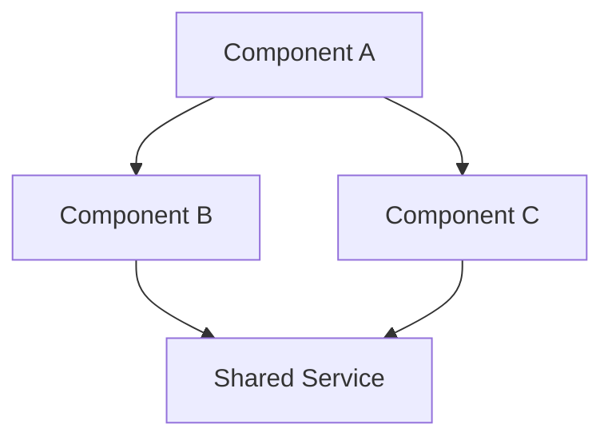
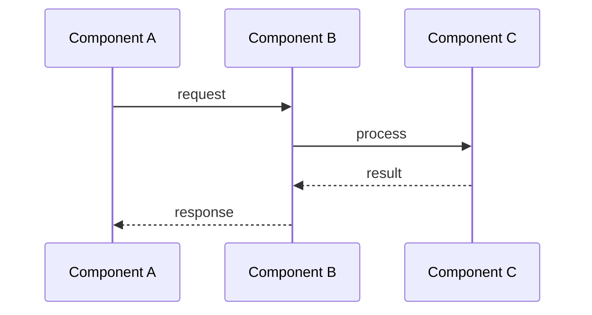
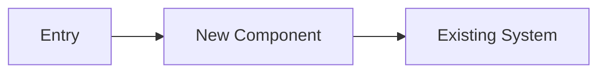

# Document Format Templates

Generic templates for architecture and design documents. These are codebase-agnostic and adapt to any project.

## Architecture Overview Document

```markdown
# <Project Name> Architecture Overview

**Date**: YYYY-MM-DD
**Scope**: <What areas/modules this document covers>
**Tech Stack**: <Discovered languages, frameworks, key libraries>

## Table of Contents
<Auto-generated from headings>

## 1. Executive Summary

<2-3 paragraphs: what the system does, its primary architecture style
(monolith, microservices, modular monorepo, etc.), and key design principles>

## 2. High-Level Architecture

<Mermaid diagram showing major components and their relationships>



<Brief description of the diagram>

## 3. <Area 1 Name>

**Path**: `<relative/path/to/area>`
**Purpose**: <What this area does>
**Key components**: <List of main modules/classes>
**Deep dive**: [<Area 1> Architecture](./<project>-<area1>.md)

## 4. <Area 2 Name>
...

## Cross-References

| Document | Scope |
|----------|-------|
| [<Area 1> Deep Dive](./<project>-<area1>.md) | <Brief scope> |
| [<Area 2> Deep Dive](./<project>-<area2>.md) | <Brief scope> |

## Glossary

| Term | Definition |
|------|-----------|
| <Term> | <Definition> |
```

## Deep-Dive Area Document

```markdown
# <Area Name> Architecture

**Area**: <Specific domain/module>
**Path**: `<relative/path/>`
**See also**: [Overview](./overview.md) | [Related Area](./related.md)

## Overview

<What this area does, its role in the overall system, key responsibilities>

## Components

### <Component 1>
- **File**: `<relative/path/to/file>`
- **Type**: <class/module/service/etc.>
- **Purpose**: <What it does>
- **Key methods/exports**: <List>

### <Component 2>
...

## Data Flow

<Mermaid sequence diagram for the primary flow>



<Additional flows as needed>

## Key Interfaces

### <Interface/API Name>
- **Location**: `<file path>`
- **Consumers**: <Who uses it>
- **Contract**: <Key methods/properties>

## Dependencies

### Depends On
- `<package/module>` — <why>

### Depended On By
- `<package/module>` — <why>
```

## Verification Report

```markdown
# Verification Report: <Document Name>

**Date**: YYYY-MM-DD
**Document verified**: <path to document>
**Verifier**: Code-Flow-Analyzer agent

## Summary

| Metric | Count |
|--------|-------|
| Total items verified | N |
| Accurate | N |
| Inaccurate | N |
| Minor corrections | N |

## Verified Items

- [x] <Item>: Verified correct
- [x] <Item>: Verified correct

## Inaccuracies Found

### <Item>
- **Claimed**: <What the doc says>
- **Actual**: <What the code shows>
- **Correction**: <What to change>

## Action Plan

1. <Correction to apply>
2. <Correction to apply>
```

## Design Options Document

```markdown
# Design Options: <Feature Name>

**Feature**: <Brief description>
**Date**: YYYY-MM-DD
**Based on**: [Investigation](./investigation.md)

## Context

<Problem statement, why this feature is needed, relevant architectural constraints>

## Options

### Option A: <Descriptive Name>

**Approach**: <How this option works>

**Affected Modules**:
- `<path>` — <what changes>

**Complexity**: Low / Medium / High



**Pros**:
- <advantage>

**Cons**:
- <disadvantage>

### Option B: <Descriptive Name>
...

## Comparison Matrix

| Criterion | Option A | Option B |
|-----------|----------|----------|
| Complexity | Low | Medium |
| Risk | Low | Medium |
| Extensibility | Medium | High |

## Recommendation

<If there's a clear winner, state it and why>
```
