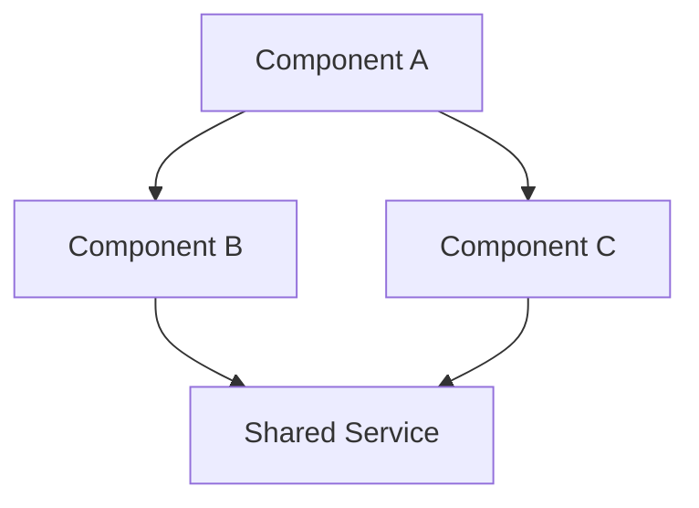
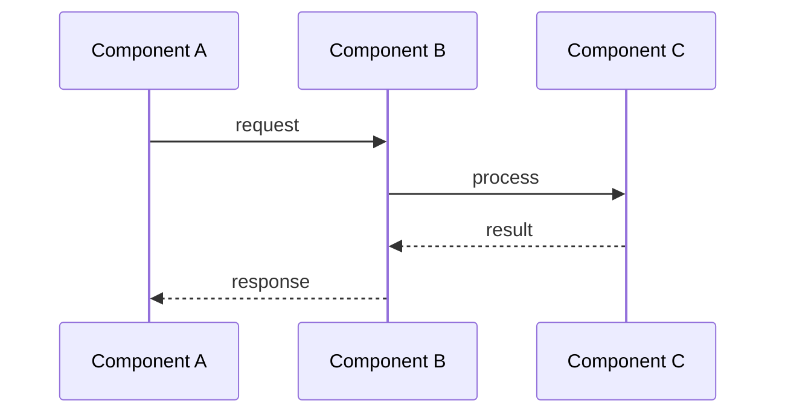
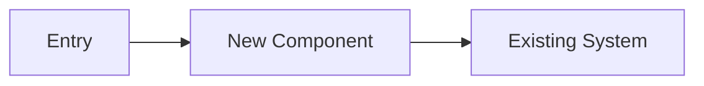

# Document Format Templates

Generic templates for architecture and design documents. These are codebase-agnostic and adapt to any project.

## Architecture Overview Document

```markdown
# <Project Name> Architecture Overview

**Date**: YYYY-MM-DD
**Source Commit**: <full Git commit SHA documented by this version>
**Scope**: <What areas/modules this document covers>
**Tech Stack**: <Discovered languages, frameworks, key libraries>

## Table of Contents
<Auto-generated from headings>

## 1. Executive Summary

<2-3 paragraphs: what the system does, its primary architecture style
(monolith, microservices, modular monorepo, etc.), and key design principles>

## 2. High-Level Architecture

<Mermaid diagram showing major components and their relationships>


```mermaid
graph TD
    A[Component A] --> B[Component B]
    A --> C[Component C]
    B --> D[Shared Service]
    C --> D
```

<Brief description of the diagram>

## 3. <Area 1 Name>

**Path**: `<relative/path/to/area>`
**Purpose**: <What this area does>
**Key components**: <List of main modules/classes>
**Deep dive**: [<Area 1> Architecture](./<project>-<area1>.md)

## 4. <Area 2 Name>
...

## Cross-References

| Document | Scope |
|----------|-------|
| [<Area 1> Deep Dive](./<project>-<area1>.md) | <Brief scope> |
| [<Area 2> Deep Dive](./<project>-<area2>.md) | <Brief scope> |

## Glossary

| Term | Definition |
|------|-----------|
| <Term> | <Definition> |

## Future Considerations

- <Architecture or UX concern to revisit later>
- <Scalability, performance, or operational cost watch item>
```

## Deep-Dive Area Document

```markdown
# <Area Name> Architecture

**Date**: YYYY-MM-DD
**Area**: <Specific domain/module>
**Path**: `<relative/path/>`
**Source Commit**: <full Git commit SHA documented by this version>
**See also**: [Overview](./overview.md) | [Related Area](./related.md)

## Overview

<What this area does, its role in the overall system, key responsibilities>

## Components

### <Component 1>
- **File**: `<relative/path/to/file>`
- **Type**: <class/module/service/etc.>
- **Purpose**: <What it does>
- **Key methods/exports**: <List>

### <Component 2>
...

## Data Flow

<Mermaid sequence diagram for the primary flow>


```mermaid
sequenceDiagram
    participant A as Component A
    participant B as Component B
    participant C as Component C
    A->>B: request
    B->>C: process
    C-->>B: result
    B-->>A: response
```

<Additional flows as needed>

## Key Interfaces

### <Interface/API Name>
- **Location**: `<file path>`
- **Consumers**: <Who uses it>
- **Contract**: <Key methods/properties>

## Dependencies

### Depends On
- `<package/module>` — <why>

### Depended On By
- `<package/module>` — <why>
```

## Verification Report

```markdown
# Verification Report: <Document Name>

**Date**: YYYY-MM-DD
**Document verified**: <path to document>
**Verifier**: Code-Flow-Analyzer agent

## Summary

| Metric | Count |
|--------|-------|
| Total items verified | N |
| Accurate | N |
| Inaccurate | N |
| Minor corrections | N |

## Verified Items

- [x] <Item>: Verified correct
- [x] <Item>: Verified correct

## Inaccuracies Found

### <Item>
- **Claimed**: <What the doc says>
- **Actual**: <What the code shows>
- **Correction**: <What to change>

## Action Plan

1. <Correction to apply>
2. <Correction to apply>
```

## Resources Investigation Document

Produced by the Technical-Resource-Investigator in Phase 1 (Step 1.5 discovery, Step 1.6 critique).
All external claims and recommendations are governed by
[trusted-source-policy.md](./trusted-source-policy.md) — every external recommendation and factual
claim must carry an allowlisted citation (citation-host invariant). The critique pass is
**append-only / provenance-preserving**: it must not delete or overwrite first-pass evidence.

```markdown
# Resources Investigation: <Feature Name>

**Feature**: <Brief description>
**Date**: YYYY-MM-DD
**Investigator**: Technical-Resource-Investigator agent
**Based on**: [Investigation](./investigation.md)
**Source policy**: governed by the skill's `references/trusted-source-policy.md`

## Research Tools

| Tool | Status |
|------|--------|
| Documentation MCP | available / unavailable |
| GitHub / registry lookup | available / unavailable |
| WebFetch / WebSearch | available / unavailable |

> External research is policy-bound (source-quality), not domain-restricted. If all reliable
> research tools are unavailable, external research is **UNAVAILABLE** and only repository-local
> discovery/validation was performed — state that here.

## Candidate Resources

### Internal Reuse Candidates (validated from investigation.md)

| Resource | Location | Fit | Notes |
|----------|----------|-----|-------|
| <component/utility> | `<relative/path>` | High / Medium / Low | <why it fits, do not re-trace flow> |

### External Candidates

| Candidate | Type | Citation (allowlisted) | Status |
|-----------|------|------------------------|--------|
| <package/service/API> | package / service / platform / API | <allowlisted URL or MCP doc ref> | recommended / unverified / rejected |

## Facts vs Recommendations

- **Facts** (each cited): <version, license, maintenance, advisories, capabilities> — `<citation>`
- **Recommendations** (agent judgment): <what to use and why; never smuggling uncited facts>

## Advisory / Security Notes

- **Source**: GitHub Security Advisories / OSV (read-only; not `npm audit`)
- <GHSA/OSV id> — <severity, affected versions, citation>

## License

| Candidate | License | Obligations / compatibility |
|-----------|---------|-----------------------------|
| <name> | <SPDX id> | <notes> |

## Maintenance Signals

- Release cadence, last release, open-issue backlog, bus factor, deprecation signals (each cited).

## Reliability / Operational Notes

- Stability, breaking-change history, runtime/infra footprint, operational cost implications.

## Decision Matrix

| Criterion | <Candidate A> | <Candidate B> | Build in-repo |
|-----------|---------------|---------------|---------------|
| Fit | | | |
| Security | | | |
| Maintenance | | | |
| License | | | |
| Supply-chain risk | | | |
| Operational cost | | | |

## Recommended Resources

- <recommended internal/external resource> — <architecture-facing rationale, allowlisted citation>

## Rejected / Unverified Resources

- <candidate> — **rejected/unverified**: <reason; e.g., fails citation-host invariant>

## Critique & Amendments (Step 1.6 — append-only)

> If skipped: "No external or material candidates — critique pass skipped. Reason: <reason>."

- **Security**: <findings>
- **Reliability**: <findings>
- **Maintenance**: <findings>
- **License**: <findings>
- **Ecosystem health**: <findings>
- **Supply-chain risk**: <findings>
- **Operational cost**: <findings>
- **Citation quality**: <candidates demoted to unverified, if any>
- **Uncertainty**: <what remains unproven>

## Revised Recommendations (Step 1.6 — append-only)

- <updated recommendation after critique; original first-pass evidence above is preserved>

## Unresolved Risks

- <open risk to carry into design / architecture review>

## Inputs for Architecture-Reviewer

- <architecture-facing resource decisions, risks, and constraints — not implementation tasks>
```

## Design Options Document

```markdown
# Design Options: <Feature Name>

**Feature**: <Brief description>
**Date**: YYYY-MM-DD
**Based on**: [Investigation](./investigation.md)

## Context

<Problem statement, why this feature is needed, relevant architectural constraints>

## Options

### Option A: <Descriptive Name>

**Approach**: <How this option works>

**Affected Modules**:
- `<path>` — <what changes>

**UX Guidance**:
- <Key UX principle or interaction rule>

**Layout Map (text only)**:
```text
Screen: <name>
- Header: ...
- Main content: ...
- Secondary actions: ...
```

**Complexity**: Low / Medium / High


```mermaid
graph LR
    A[Entry] --> B[New Component]
    B --> C[Existing System]
```

**Pros**:
- <advantage>

**Cons**:
- <disadvantage>

### Option B: <Descriptive Name>
...

## Comparison Matrix

| Criterion | Option A | Option B |
|-----------|----------|----------|
| Complexity | Low | Medium |
| Risk | Low | Medium |
| Extensibility | Medium | High |
| UX Clarity | High | Medium |
| Reusability | High | Medium |
| Operational Cost | Low | Medium |

## Recommendation

<If there's a clear winner, state it and why>

## Architecture Review Notes

- **Summary**: <Key critique from architecture-reviewer>
- **Future Considerations**:
  - <Item>
  - <Item>
```

## Implementation Interview Document

Transcript and decision evidence for the Implementation Clarification Gate (Phase 2 entry precondition). Decisions captured here are folded into `implementation-plan.md`, which remains the single source of truth for downstream agents.

```markdown
# Implementation Interview: <Feature Name>

**Feature**: <Brief description>
**Date**: YYYY-MM-DD
**Approved design**: [Design Options](./design-options.md) — Option <X>
**Sources reviewed**: design-options.md, ux-review.md, architecture review (future considerations / open questions), feature spec

## Open Questions & Proposed Defaults

| # | Question | Source artifact | Why implementation-critical | Proposed default |
|---|----------|-----------------|-----------------------------|------------------|
| 1 | <Unresolved question> | `design-options.md` | <Impact on scope/approach> | <Default if waived> |
| 2 | <Unresolved question> | `ux-review.md` | <Impact> | <Default if waived> |

> If no implementation-critical questions remain unresolved, state that explicitly:
> "Gate completed with no open questions."

## Decisions

| # | Decision | Resolution type |
|---|----------|-----------------|
| 1 | <Answered value> | Answered |
| 2 | <Accepted default> | Waiver (accepts default) |

## Waivers

- **Q<#>**: Explicitly waived; workflow proceeds with the proposed default `<default>`.

## Scope/Approach Impact

- **Material change?**: Yes / No
- If **Yes**: returned to USER REVIEW GATE to update `design-options.md` and obtained fresh approval before continuing.

## Plan Integration

- These decisions and waivers are folded into [`implementation-plan.md`](./implementation-plan.md).
- Downstream agents consume the plan, not this transcript.
```
