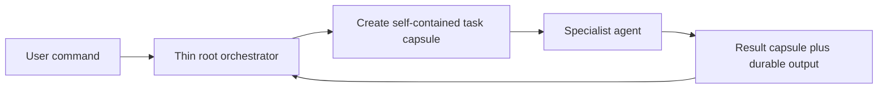

# Issue #44: Long-Running Orchestration Context Options

**Date**: 2026-09-17  
**Source Commit**: `235fe4a`  
**Scope**: DevDude root-skill orchestration and long-session context retention  
**Status**: Option 1 selected on 2026-09-17; implementation approved

## Problem

DevDude's root skills currently combine durable orchestration rules with prerequisite setup,
command routing, workflow summaries, and links to detailed workflow references. During a long run,
especially after context compaction, the active agent can retain the immediate task while losing the
larger workflow contract: which phase it is in, which gates remain, what agents own each functional
block, and which invariants must be applied to every task.

The detailed functional workflows already live in `references/`, but the root skills repeat parts of
them. This both consumes context and creates two competing sources of instruction. The Claude and
Copilot variants add another parity requirement: the solution must preserve equivalent behavior
without forcing both runtimes to carry unnecessary detail in their always-loaded root skill.

## Decision Drivers

1. Re-establish the orchestration contract after compaction without relying on conversational memory.
2. Keep the root skill a pure, small orchestrator rather than an executor of functional blocks.
3. Preserve user gates, phase ordering, context injection, concurrency limits, and validation rules.
4. Recover safely at phase boundaries and, ideally, during partially completed phases.
5. Keep Claude and Copilot workflows behaviorally equivalent.
6. Minimize additional files, writes, and sources of truth.

## Option 1: Thin Orchestrator with Durable Run State

Reduce each root `SKILL.md` to prerequisite coordination, argument routing, global guardrails, and
dispatch into functional workflow skills. Add a small durable run-state document for every active
orchestration. Each functional skill records phase entry, delegated tasks, completed outputs, gate
decisions, and the next valid transition. On initial entry, phase changes, and resume, the root
orchestrator reloads the run state and only the skill for the current functional block.

The run state is a checkpoint, not unquestioned truth. Resume first reconciles it with durable
outputs and repository state so an interrupted checkpoint write cannot cause completed work to be
repeated or incomplete work to be skipped.

**Functional split**

- Root orchestrator: setup, routing, invariant enforcement, recovery, and transitions only.
- Architecture workflow skill: discovery through verified architecture documentation.
- Feature-design skill: investigation through the user review gate.
- Feature-implementation skill: clarification, planning, implementation, and testing.
- Validation skill: verification and bounded remediation.

**Reinforcement strategy**

- Re-read the compact run state at every phase entry and after any resume.
- Include a short orchestration envelope in every delegated task: run identifier, current phase,
  permitted action, expected output, completion condition, and next owner.
- Load only the current functional skill, keeping unrelated instructions out of active context.

**Advantages**

- Strongest recovery for both cross-phase and mid-phase context loss.
- Makes ownership boundaries explicit and keeps the root skill in lane.
- Uses durable state rather than hoping compaction preserves earlier instructions.
- Low steady-state context cost because only the current block is loaded.

**Risks and mitigations**

- A stale checkpoint could misroute work. Treat state as a hint and reconcile it against outputs.
- Frequent writes add orchestration overhead. Checkpoint only at task and gate boundaries.
- A new schema can drift between runtimes. Define one runtime-neutral schema and mirror only
  runtime-specific dispatch syntax.

**Migration scope**: Medium. Both root skills and paired workflow references must be refactored, and
the run-state format and recovery contract must be introduced.

## Option 2: Thin Orchestrator with Phase-Entry Reloads

Reduce the root skills in the same way, but do not create explicit run state. Instead, make each
functional skill self-contained and require the root orchestrator to reload the applicable skill at
every phase boundary. Existing output documents and repository changes are inspected to infer the
current phase when a session resumes.

**Reinforcement strategy**

- Every functional skill begins with its entry criteria, invariants, allowed actions, and exit
  criteria.
- Every phase transition explicitly returns control to the root orchestrator.
- Resume reconstructs state from approved designs, implementation records, verification reports,
  and repository changes.

**Advantages**

- Smallest implementation and operational footprint.
- No new state artifact or checkpoint-writing discipline.
- Functional instructions are refreshed near the moment they are needed.
- Straightforward to keep Claude and Copilot behavior aligned.

**Risks and mitigations**

- Output inference cannot reliably distinguish all partially completed parallel tasks.
- Compaction inside a phase can still lose task-level progress before an output is written.
- Repeating invariants in several skills can recreate instruction drift. Keep global invariants in
  the root orchestration envelope and put only block-specific rules in each functional skill.

**Migration scope**: Low. Primarily split workflow references into functional skills, slim the root
skills, and add explicit phase-entry reload and return rules.

## Option 3: Stateless Task Capsules

Make the root skill a dispatcher that expresses every unit of work as a self-sufficient task
capsule. A capsule contains the orchestration identity, approved inputs, current phase, constraints,
required context paths, expected outputs, validation criteria, and continuation route. Specialist
agents receive capsules and return a result capsule that the root uses to construct the next task.
The documents produced by the workflow remain the durable record; there is no mutable central run
state.

**Reinforcement strategy**

- Reassert the relevant orchestration contract in every task rather than only at phase entry.
- Require result capsules to name satisfied exit criteria, produced artifacts, unresolved items,
  and the next permissible transition.
- Reconstruct a continuation capsule from the latest durable output after resume.

**Advantages**

- Strong resistance to instruction loss while an individual agent works.
- Clear delegation boundaries and independently auditable task contracts.
- Naturally supports parallel work without sharing a large conversational context.
- Avoids a mutable state file.

**Risks and mitigations**

- Repeating complete capsules increases token use and can itself accelerate compaction.
- Without central state, coordinating multiple parallel result capsules is complex.
- A malformed or incomplete capsule can silently omit an invariant. Define strict required fields
  and reject incomplete results before transitioning.
- Resume remains weaker than Option 1 when results were produced but not durably recorded.

**Migration scope**: Medium to high. All delegation prompts and agent result contracts must adopt the
capsule format in both runtimes.

## Comparison

| Criterion | Option 1: Durable state | Option 2: Phase reloads | Option 3: Task capsules |
|---|---|---|---|
| Root skill purity | Strong | Strong | Strong |
| Phase-level compaction recovery | Strong | Moderate | Strong |
| Mid-phase recovery | Strong | Weak | Moderate |
| Context efficiency | Strong | Strongest | Moderate |
| New operational state | One reconciled checkpoint | None | Distributed result records |
| Parallel-task coordination | Strong | Weak | Moderate |
| Migration size | Medium | Low | Medium-high |
| Runtime parity effort | Medium | Low | Medium-high |

## Recommendation

Choose **Option 1: Thin Orchestrator with Durable Run State**. It is the only option that directly
addresses loss of both the orchestration contract and partial progress. Its principal risk, stale
state, is controllable through reconciliation and boundary-only updates. It also best matches the
requested architecture: the root skill remains a pure orchestrator while functional blocks become
independently reloadable skills.

Option 2 is appropriate if minimizing change is more important than recovering partial parallel
work. Option 3 offers the strongest per-delegation reinforcement, but its repeated context and
distributed coordination cost make it less suitable for the longest runs.

## Selection Gate

No implementation should begin until one option is explicitly selected. After selection, the next
step is a concrete implementation plan covering the Claude and Copilot variants, migration of the
functional blocks, compatibility of existing commands and outputs, and focused structural
validation.
